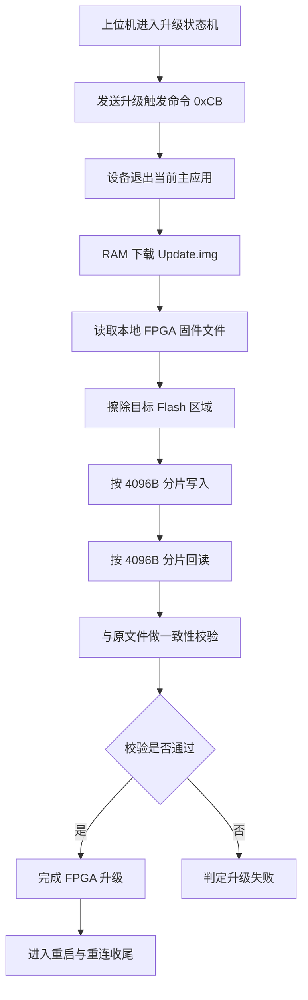

# FPGA 固件烧写流程分析报告

## 1. 结论摘要

当前系统中的 FPGA 固件烧写，不是在现行运行态主固件中直接完成，而是通过一条独立的升级链路完成。

该链路的核心机制如下：

1. 上位机先触发设备退出当前主应用。
2. 上位机将 Update.img 以 RAM 下载方式装载到设备中运行。
3. 上位机从本地读取待升级的 FPGA 固件文件。
4. 上位机按固定大小分片，将固件数据发送给设备侧升级专用固件。
5. 设备侧升级专用固件执行 Flash 擦除、写入和读取。
6. 上位机对回读数据和原始文件做一致性校验。
7. 校验通过后，完成 FPGA 固件升级并进入后续重启收尾流程。

从职责边界看：

- SWJ 上位机是升级流程的主调度者。
- 当前 FX3 主固件只负责触发切换到升级路径。
- Update.img 是升级阶段真正执行设备侧写 Flash 操作的固件承载体。
- FPGA 固件文件是升级输入，不在当前主固件运行态内被解释或解析。

## 2. 角色分工

### 2.1 SWJ 上位机

上位机承担升级主控职责，负责：

- 发起升级流程
- 触发主固件退出正常应用
- RAM 下载 Update.img
- 读取本地 FPGA 固件文件
- 进行目标区域擦除
- 按分片写入固件数据
- 回读并校验写入结果
- 控制升级收尾与设备重连等待

### 2.2 当前 FX3 主固件

当前主固件不是 FPGA 烧写执行主体，其职责仅包括：

- 接收升级触发命令
- 操作自身启动区或升级入口相关逻辑
- 让出当前正常应用执行路径

换言之，当前主固件负责“切换到升级态”，而不负责“在当前运行态下直接烧写 FPGA 文件”。

### 2.3 Update.img 升级专用固件

Update.img 在升级阶段由上位机动态下载到设备 RAM 中运行，其作用是：

- 接管设备侧升级命令处理
- 执行底层 Flash 擦除
- 执行底层 Flash 写入
- 支持回读用于校验

Update.img 是设备侧升级执行核心。

### 2.4 外部 FPGA 固件文件

外部 FPGA 固件文件由上位机从配置路径读取，当前代码中将其整体按二进制字节流装入内存后逐块发送。

从现有实现看，上位机并不对该文件进行复杂协议解析，而是将其视为待写入目标数据。

## 3. 总体流程

### 3.1 流程概览

### 3.2 时序展开

#### 步骤一：进入升级状态机

升级入口位于上位机的 UpdateFirmwareMachine::process。

该流程首先检查 USB 连接状态，确认设备可达后，进入固件更新主流程。

#### 步骤二：触发设备退出当前主应用

上位机调用 corrupt()，触发升级入口命令。

这一步的作用不是直接写 FPGA 固件，而是破坏当前主固件的正常应用入口，使设备回到可升级路径，准备由 Update.img 接管后续升级操作。

#### 步骤三：RAM 下载 Update.img

上位机调用 downloadUpdateImg("firmware\\Update.img")。

底层通过 Cypress 提供的 DownloadFw(..., RAM) 机制，将 Update.img 装载到设备 RAM 中运行。此后，设备侧负责处理升级命令的，不再是当前运行态主固件，而是 Update.img。

#### 步骤四：选择 FPGA 固件文件

上位机从外部配置读取：

- firmware_path
- fpga_name

然后拼接出实际待烧写的 FPGA 固件文件路径。

这意味着升级使用的具体 FPGA 文件，不是写死在当前仓库代码里的，而是由配置驱动。

#### 步骤五：装载 FPGA 固件文件

上位机通过 importFirmware(FPGA, fileName) 将目标文件整体读入内存缓冲区。

现有实现中，该装载过程按二进制文件处理，不在上位机侧拆解文件结构，也不做额外格式解释。

#### 步骤六：擦除目标区域

上位机调用 earseChip(FPGA) 擦除目标固件区域。

状态机中，FPGA 擦除阶段按预设步数推进，用于表示擦除进度。从代码逻辑看，FPGA 擦除阶段使用 16 步进度计数。

#### 步骤七：分片写入 FPGA 固件

擦除完成后，上位机进入 writeFlash(FPGA) 流程。

当前流程采用固定分片写入机制：

- 单片大小固定为 4096 字节
- 每次从总缓冲区中截取一个 4096 字节块
- 每块数据通过控制端点写入设备
- 每片失败后允许有限次数重试

#### 步骤八：回读并校验

全部写入完成后，上位机执行 verify(FPGA)。

验证逻辑如下：

- 按同样的 4096 字节粒度从设备回读
- 将回读结果拼接到校验缓冲区
- 将校验缓冲区与原始固件缓冲区执行 memcmp 比较

若两者完全一致，则判定 FPGA 固件写入成功；否则判定升级失败。

#### 步骤九：完成收尾

当 FPGA 升级成功后，系统根据升级策略决定是否继续更新 FX3 固件。全部升级流程完成后，系统进入设备重启、USB 重连和状态恢复等待阶段。

## 4. 关键命令与数据流

本节仅从 FPGA 烧写视角解释命令语义。

### 4.1 升级触发命令：0xCB

作用：触发当前主固件退出正常应用，进入升级路径。

说明：

- 该命令不是实际写入 FPGA 固件的数据命令。
- 其核心作用是为 Update.img 接管升级流程创造执行条件。

### 4.2 擦除命令：0xCF

作用：擦除目标固件区域。

说明：

- 上位机通过 earseChip(FPGA) 发出该命令。
- 设备侧升级专用固件负责执行底层 Flash 擦除。

### 4.3 写入命令：0xC2

作用：发送 FPGA 固件数据分片。

说明：

- 在升级阶段，该命令承担“写入 Flash 数据块”的语义。
- 每次承载 4096 字节数据。
- 命令中的 index 字段用于表达分片对应的页地址步进。

特别说明：

0xC2 在系统其他历史上下文中可能有不同语义，因此本报告中对 0xC2 的解释，仅限于升级阶段，不与运行态主固件协议混读。

### 4.4 回读命令：0xB3

作用：从设备侧回读已写入的固件分片，用于校验。

说明：

- 上位机按 4096 字节粒度读取。
- 回读结果直接参与与原始文件的一致性比较。

### 4.5 RAM 下载接口：DownloadFw(..., RAM)

作用：将 Update.img 下载到设备 RAM 中执行。

说明：

- 该机制是整个升级链的关键切换点。
- 它决定了升级阶段的设备侧执行环境与当前运行态主固件并不是同一套固件逻辑。

## 5. 分片与寻址逻辑

### 5.1 固定分片大小

当前 FPGA 固件写入使用固定分片大小：

- PRE_BUFFER_SIZE = 4096 字节

因此，无论目标文件总大小是多少，都会被拆分为若干个 4096 字节块，再逐块发送。

### 5.2 写入索引步进

写入调用的关键形式为：

- writeFlash(modle, 16 * index, buffer)

这里说明写入地址并不是按字节地址直接递增，而是按某种页编号或页组编号递增。

### 5.3 与 Flash 页大小的对应关系

在当前 FX3 主固件仓库中，可以找到如下 Flash 几何参数：

- PAGE_SIZE = 256 字节
- SECTOR_SIZE = 64 KB
- SECTOR_NUMBER = 8

据此可得：

- 4096 / 256 = 16

这说明一个 4096 字节分片，正好对应 16 个 256 字节 page。

因此，写入调用中使用 16 * index 的步进方式，是合理的：

- 第 0 片写第 0 到第 15 page
- 第 1 片写第 16 到第 31 page
- 依此类推

### 5.4 结论

从现有代码可以较高置信度推断：

- 上位机按 4 KB 为单位组织写入
- 设备侧升级固件按 page 为单位执行 Flash 写入
- 每 1 个主机分片对应 16 个底层 page

这套逻辑与当前仓库中已知的 Flash 几何参数是自洽的。

## 6. 证据链

### 6.1 已验证结论

以下内容已可由现有代码直接验证：

1. 上位机存在独立的 FPGA 固件升级状态机。
2. 升级流程开始前，上位机会先触发设备退出当前主应用。
3. Update.img 会以 RAM 下载方式被装载到设备中运行。
4. FPGA 固件文件来自外部配置指定路径。
5. FPGA 固件写入以 4096 字节为固定分片单位。
6. 写入后存在回读校验闭环。

### 6.2 合理推断结论

以下结论未在当前工作区中直接拿到设备侧源码，但基于现有证据可作高置信度推断：

1. Update.img 内部负责解释升级阶段的擦除、写入、回读命令。
2. Update.img 内部负责具体的底层 Flash 擦除和 page 写入动作。
3. FPGA 固件实际落盘位置应与当前仓库中所见 Flash 几何参数具有一致的页组织方式。

### 6.3 当前缺口

当前工作区内尚缺以下关键证据：

1. Update.img 对应源码或工程文件。
2. Update.img 的命令分发表。
3. 升级专用固件内部对物理 Flash 地址布局的直接说明。
4. 升级完成后 FPGA 如何从目标 Flash 自举加载的设备侧源码证据。

因此，本报告可以完整说明“升级流程如何发起、如何传输、如何校验”，但还不能在当前证据范围内，百分之百证明 Update.img 内部每一条命令的具体实现细节。

## 7. 风险与建议

### 7.1 主要风险

#### 风险一：外部配置依赖风险

升级使用的 firmware_path 和 fpga_name 来自外部配置文件。如果配置错误，存在烧错 FPGA 固件文件的风险。

#### 风险二：命令号跨阶段复用风险

升级阶段与运行阶段可能存在同号命令语义不同的情况。若缺少明确文档，维护人员容易误判协议语义，影响问题定位效率。

#### 风险三：Update.img 源码缺失风险

当前工作区未纳入 Update.img 对应源码，这意味着：

- 问题定位深度受限
- 升级异常时无法直接向设备侧执行逻辑继续下钻
- 升级链维护对历史经验依赖较强

### 7.2 建议

1. 补齐 Update.img 源码或至少补齐其命令表文档。
2. 固化 firmware_path 和 fpga_name 的版本命名规则，减少配置误用风险。
3. 建立单独的 FPGA 升级 SOP，明确升级前检查、操作步骤、失败判定和回滚策略。
4. 为升级链单独维护一份命令号说明文档，避免与主固件运行态协议混淆。

## 8. 汇报结论

基于当前代码证据，可以确认系统已经具备完整的 FPGA 固件烧写闭环：上位机能够完成升级触发、升级固件装载、目标文件读取、Flash 擦除、分片写入、回读校验以及升级收尾。

当前系统最大的短板，不在于升级流程是否存在，而在于升级专用固件 Update.img 的源码与文档缺失。这会直接影响后续维护效率、故障定位深度以及跨团队交接质量。

因此，从管理角度看，当前最优先的改进方向，不是重新设计烧写流程，而是补齐升级专用固件文档与工程可追溯性。

## 9. 附录：关键代码定位

### 9.1 上位机侧关键位置

- `SWJ/Common/DeviceStateMachine/UpdateFirmwareState.cpp`
  - `UpdateFirmwareMachine::process`
  - `UpdateFirmwareMachine::updateFpga`
  - `UpdateFirmwareMachine::update`
  - `UpdateFirmwareMachine::writeFlash`
  - `UpdateFirmwareMachine::readFlash`
  - `UpdateFirmwareMachine::verify`
  - `UpdateFirmwareMachine::importFirmware`

- `SWJ/Common/DeviceController/DeviceController.cpp`
  - `DeviceController::downloadUpdateImg`
  - `DeviceController::writeFlash`
  - `DeviceController::backupFirmware`
  - `DeviceController::earseChip`

- `SWJ/Common/DeviceController/Fx3Controller.h`
  - `DownLoadFirmwareController::requestMethord`

- `SWJ/Common/DeviceStateMachine/machine.json`
  - 外部配置入口

- `SWJ/Common/DeviceControllerCommon/JsonHelper.cpp`
  - 配置解析入口

### 9.2 主固件侧关键位置

- `FX3_1.1.0/FX3_1.1.1/cyfxslfifosync.c`
  - `CY_FX_RQT_COMMAND_UPDATE`
  - `CyFxUpdate()`

- `FX3_1.1.0/FX3_1.1.1/cyfxslfifosync.h`
  - `PAGE_SIZE`
  - `SECTOR_SIZE`
  - `SECTOR_NUMBER`

### 9.3 说明

本附录用于支撑正文中的关键结论追溯，不作为完整源码说明文档使用。